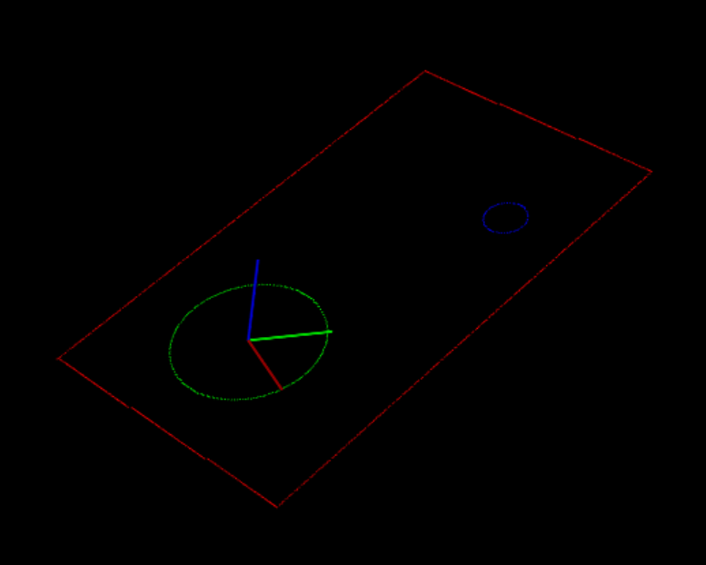
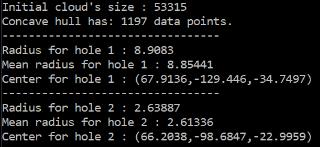

# PCLHoleAnalysis
Detecting holes in a point cloud and giving measures such as radii, center and normal at the center with PCL Library.

First, edges are detected by using ConcaveHull, then clustered using EuclideanClusterExtraction (see colors of the different clusters) :

This enable to isolate 2 circles for computing metrics :

A file "HoleDetectionDataWithNormals.ply" containing the normals of the initial cloud's points is then created.
The two last points in the file are the normals of the detected circle's centers.

## Build & Run program - Requirements
- PCL version >=1.2 + 3d party libraries (Boost, Eigen...) installed
- CMake

Build the code using CMake, with Visual Studio 2015 generator and platform Win32.

Note: The program assumes that solution was built in a folder /build inside the folder containing the CMake file. Ths is why the path for reading point cloud is "../data/HoleDetectionTestData.txt"
